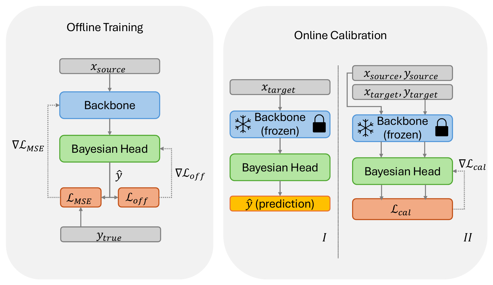

# Model-Agnostic Online Certificate-Driven Calibration<br>for Time Series Forecasting Under Distribution Shift <br>(UAI 2026 Oral)


Official implementation for **OMPB**, Online martingale PAC-Bayes calibration framework, accepted as Uncertainty in Artificial Intelligence (UAI) 2026 Oral.
## Authors
**Chenfeng Huang**, Zixuan Ma, George Michailidis


>Time series out-of-distribution generalization requires forecasters to remain reliable when deployment dynamics differ
from training conditions due to covariate shift, concept shift, and temporal dependence. Probably Approximately Correct
Bayesian domain adaptation provides computable certificates by decomposing target risk into a source risk term, a
source-to-target mismatch term, and a complexity term, but standard analyses rely on independent sampling and
distributional stability, assumptions that are violated in time series by serial dependence and nonstationary shift. We
propose a model-agnostic online martingale Probably Approximately Correct Bayesian framework that yields finite-sample
certificates under temporal dependence and distribution shift. The certificate replaces independent-sample
concentration with martingale concentration that adapts to loss scale and predictable variation. We use the certificate
as a surrogate regularizer for online calibration by training a gated residual Bayesian head on top of a fixed
forecasting backbone, producing a corrective update that reverts to the backbone prediction when the gate is closed.
Online calibration combines a source risk anchor, a posterior-shift penalty, and a time-adaptive mismatch term computed
from target windows observed before forecasting. It follows a predict-then-update protocol in which outcomes become
available only after forecasting and are used to update subsequent predictions. Experiments across convolutional,
attention-based, and large language model-based forecasters show improved stability and accuracy under covariate and
concept shift.

## Installation

### Prerequisites

- Python 3.11 or higher
- CUDA-compatible GPU (recommended)

### Setup

1. **Clone the repository**:
```bash
git clone https://github.com/chenfeng-huang/OMPB-UAI-2026
cd OMPB-UAI-2026
```

2. **Create the conda environment**:
```bash
conda create -n OMPB python=3.11 -y
conda activate OMPB
```

3. **Install dependencies**:
```bash
pip install -r requirements.txt
```

4. **Download GPT-2 checkpoint** (required for GPT4TS backbone):

The GPT4TS backbone loads a **local** GPT-2 checkpoint from `checkpoints/gpt2`.
No network access is used at runtime, so you must download the weights beforehand.

```bash
pip install huggingface_hub
hf download openai-community/gpt2 \
  --local-dir checkpoints/gpt2
```

Verify the download:
```bash
ls checkpoints/gpt2/
# Expected: config.json  generation_config.json  model.safetensors  ...
```

5. **Download datasets** (required before running experiments):

Dataset files are not included in this repository. Download them from [Google Drive](https://drive.google.com/drive/u/2/folders/1iPeIj9uZV0ULpVaH4E7ULeFhvc6pRoc1) and place the contents in the `dataset/` directory:

```bash
# Expected files after download:
ls dataset/
# ETTh1.csv  ETTh2.csv
# ILI_train.csv  ILI_test.csv
# Weather_train.csv  Weather_test_close.csv  Weather_test_far.csv
```

## Backbone Models

| Backbone | Description |
|----------|-------------|
| **TCN** | Temporal Convolutional Network with causal dilated residual blocks |
| **Autoformer** | Series decomposition with Auto-Correlation attention |
| **GPT4TS** | GPT-2-based time-series model with input patching |

## Datasets

Download all dataset files from [Google Drive](https://drive.google.com/file/d/1NnZJ1wko0Vse6tNTDDb6ENpEmndEDQ_E/view?usp=sharing) and place them in `dataset/` before running experiments.

| Dataset | Source | Target | Shift Type |
|---------|--------|--------|------------|
| **ETT** | ETTh1 | ETTh2 | Covariate shift |
| **ILI** | ILI_train | ILI_test | Concept shift |
| **Weather** | Weather_train | Weather_test_close / Weather_test_far | Near and far Covariate shift |

## Reproducing Paper Results

To reproduce the experiment results reported in the paper, manually set the training epochs in `configs/models.yaml` according to the table below before running each dataset:

| Dataset | TCN | Autoformer | GPT4TS |
|-----------|-----|------------|--------|
| ETTh | 20 | 5 | 20 |
| ILI | 100 | 100 | 100 |
| Weather | 5 | 100 | 100 |

For example, to run the **ILI** experiments, first update `configs/models.yaml`:

```yaml
tcn:
  epochs: 100

autoformer:
  epochs: 100

gpt4ts:
  epochs: 100
```

## Usage

### Run the full pipeline

```bash
# ETT dataset (default)
bash pipeline.sh

# ILI dataset
DATASET=ili bash pipeline.sh

# Weather dataset
DATASET=weather bash pipeline.sh
```

### Environment variables

All variables can be overridden at launch time (e.g., `BACKBONE_BS=128 bash pipeline.sh`):

| Variable | Default | Description |
|----------|---------|-------------|
| `DATASET` | `ett` | Dataset to run (`ett`, `ili`, `weather`) |
| `PRED_LENS` | dataset-dependent | Prediction horizons (space-separated) |
| `CONFIG_PATH` | auto | Path to dataset YAML config |
| `BACKBONE_BS` | `256` (`32` for ILI) | Backbone training batch size |
| `EVAL_BS` | `256` (`32` for ILI) | Evaluation DataLoader batch size |
| `HEAD_BS` | `256` (`32` for ILI) | Bayesian head training batch size |
| `SRC_BS` | `256` (`32` for ILI) | OMPB online source minibatch size |
| `RETRAIN` | `0` | `0` reuses saved checkpoints, `1` retrains from scratch |
| `PROGRESS` | `1` | `1` shows tqdm progress bars, `0` disables |

### Run individual scripts

```bash
# Train a single backbone
python scripts/train_backbone.py dataset=ett model=tcn

# Evaluate backbone degradation (source vs target)
python scripts/eval_degradation.py dataset=ett model=all models=gpt4ts pred_len=96

# Evaluate OMPB end-to-end
python scripts/eval_degradation_ompb.py dataset=ett model=all models=tcn,autoformer,gpt4ts pred_len=96
```

## Results

Results are saved in structured, timestamped directories under `outputs/`:

```
outputs/
└── degradation_backbone_{dataset}_sl{seq_len}_pl{pred_len}_tr{train_frac}_{YYYYMMDD_HHMMSS}/
    ├── config_snapshot.json
    ├── degradation.csv
    ├── backbone_tcn.pt
    ├── backbone_autoformer.pt
    └── backbone_gpt4ts.pt
```
